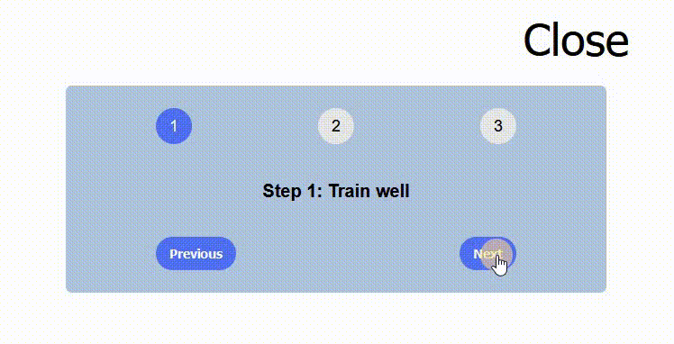

# React - Step Sequencer

# 🔗 [Live Preview](https://gentle-panda-e2b366.netlify.app/)

---

## About 👋

This React exercise provides a visually appealing step sequencer that displays motivational messages and allows users to navigate between different steps.

---

## Features 👨‍💻

- Clear Step Indication: Highlights the current step using an "active" class.
- Motivational Messages: Displays a corresponding message for each step from the provided messages array.
- User Navigation: Users can navigate through the steps using "Previous" and "Next" buttons.
- Collapsible Functionality: The sequencer can be collapsed or expanded using the "Close" or "Open" button.

---

## Explanation:

The component utilizes React's useState hook to manage two state variables:
* step: Tracks the current step (1-based indexing).
* isOpen: Indicates whether the sequencer is expanded (true) or collapsed (false).
    
#### The component displays a collapsible section containing:

* Three numbered steps, visually indicating the current step using an "active" class.
* A message corresponding to the current step, retrieved from the messages array.
* Buttons for navigating between steps and a button to toggle the collapsed/expanded state.

---

## Languages

- React: functions, conditionals, useState
- Styling: basic 
